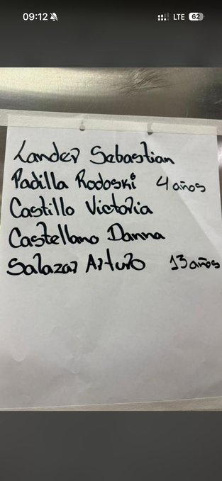

# Niños sólos en Cirugia Pediatrica Domingo Luciani

Image:

Aquí está la transcripción:

| # | Nombre | Edad |
|---|--------|------|
| 1 | Lander Sebastián | — |
| 2 | Padilla Rodoski | 4 años |
| 3 | Castillo Victoria | — |
| 4 | Castellano Danna | — |
| 5 | Salazar Arturo | 13 años |

Solo dos registros traen edad (4 y 13 años); los demás aparecen sin más datos. La letra se lee con claridad, así que no hay lecturas dudosas esta vez.
