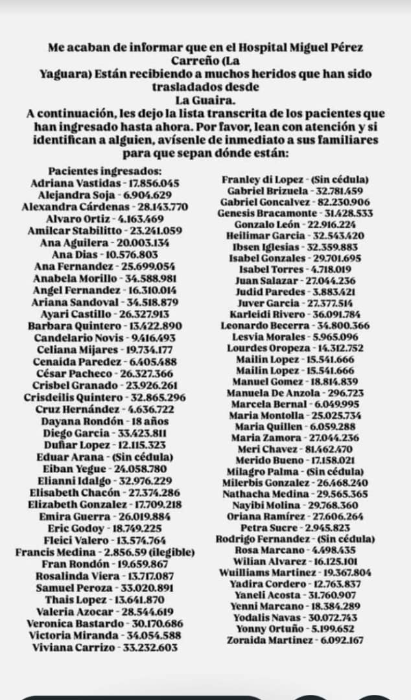

# Hosp. Pérez Carreño — La Yaguara

Imagen: 

# Hospital Miguel Pérez Carreño (La Yaguara)

> Pacientes heridos trasladados desde La Guaira. Lista mecanografiada (transcrita por la fuente original).
> Columna **Estado**: `Previo` = ya aparecía en listas anteriores · **`Nuevo`** = aparece por primera vez aquí.
> `Ref.` indica dónde se había visto antes (L1–L4 = listas iniciales, TRI = Triaje, TRA = Traumashock).

## Resumen de validación

- Total de registros: **82** (incluye un duplicado interno: *Mailin Lopez* aparece dos veces).
- Ya registrados antes: **77**.
- **Nuevos (5):** Amilcar Stabilitto, Elizabeth Gonzalez, Gabriel Goncalvez, Yodalis Navas, Zoraida Martinez.

## Nuevos registros

| Nombre | Cédula |
|--------|--------|
| Amilcar Stabilitto | 23.241.059 |
| Elizabeth Gonzalez | 17.709.218 |
| Gabriel Goncalvez | 82.230.906 |
| Yodalis Navas | 30.072.743 |
| Zoraida Martinez | 6.092.167 |

## Transcripción completa

| Nombre | Cédula | Estado | Ref. |
|--------|--------|:------:|------|
| Adriana Vastidas | 17.856.045 | Previo | L1 |
| Alejandra Soja | 6.904.629 | Previo | TRI |
| Alexandra Cárdenas | 28.143.770 | Previo | L1 / TRA |
| Alvaro Ortiz | 4.163.469 | Previo | L2 |
| Amilcar Stabilitto | 23.241.059 | **Nuevo** | — |
| Ana Aguilera | 20.003.134 | Previo | L1 / TRA |
| Ana Dias | 10.576.803 | Previo | L1 |
| Ana Fernandez | 25.699.054 | Previo | TRI |
| Anabela Morillo | 34.588.981 | Previo | TRI |
| Angel Fernandez | 16.310.014 | Previo | L2 |
| Ariana Sandoval | 34.518.879 | Previo | L3 (Adriana Sandoval) |
| Ayari Castillo | 26.327.913 | Previo | L2 |
| Barbara Quintero | 13.422.890 | Previo | L2 |
| Candelario Novis | 9.416.493 | Previo | L2 (Vovis) |
| Celiana Mijares | 19.734.177 | Previo | L3 / TRI |
| Cenaida Paredez | 6.405.488 | Previo | L1 / TRA |
| César Pacheco | 26.327.366 | Previo | L1 |
| Crisbel Granado | 23.926.261 | Previo | L2 |
| Crisdeilis Quintero | 32.865.296 | Previo | L1 |
| Cruz Hernández | 4.636.722 | Previo | L1 / TRA |
| Dayana Rondón | 18 años | Previo | L1 |
| Diego Garcia | 33.423.811 | Previo | L3 |
| Duñar Lopez | 12.115.323 | Previo | TRI |
| Eduar Arana | (Sin cédula) | Previo | L3 (Eduar Orana) |
| Eiban Yegue | 24.058.780 | Previo | TRI |
| Elianni Idalgo | 32.976.229 | Previo | TRA |
| Elisabeth Chacón | 27.374.286 | Previo | TRI |
| Elizabeth Gonzalez | 17.709.218 | **Nuevo** | — |
| Emira Guerra | 26.019.884 | Previo | L3 |
| Eric Godoy | 18.749.225 | Previo | L1 |
| Fleici Valero | 13.574.764 | Previo | L2 |
| Francis Medina | 2.856.59 (ilegible) | Previo | L1 |
| Fran Rondón | 19.659.867 | Previo | L1 / TRA |
| Rosalinda Viera | 13.717.087 | Previo | L2 |
| Samuel Peroza | 33.020.891 | Previo | L2 |
| Thais Lopez | 13.641.870 | Previo | L2 |
| Valeria Azocar | 28.544.619 | Previo | TRI |
| Veronica Bastardo | 30.170.686 | Previo | TRA (Beronica Bastardo) |
| Victoria Miranda | 34.054.588 | Previo | L3 |
| Viviana Carrizo | 33.232.603 | Previo | L3 |
| Franley di Lopez | (Sin cédula) | Previo | TRA (Franleydi Lopez) |
| Gabriel Brizuela | 32.781.459 | Previo | L3 |
| Gabriel Goncalvez | 82.230.906 | **Nuevo** | — |
| Genesis Bracamonte | 31.428.533 | Previo | L2 |
| Gonzalo León | 22.916.224 | Previo | L3 / TRI |
| Heilimar Garcia | 32.543.420 | Previo | L3 (Keilimar Garcia) |
| Ibsen Iglesias | 32.359.883 | Previo | L2 |
| Isabel Gonzales | 29.701.695 | Previo | TRA |
| Isabel Torres | 4.718.019 | Previo | TRI |
| Juan Salazar | 27.044.236 | Previo | TRA (Juan Zalazar) |
| Judid Paredes | 3.883.421 | Previo | L1 |
| Juver Garcia | 27.377.514 | Previo | L2 |
| Karleidi Rivero | 36.091.784 | Previo | TRI |
| Leonardo Becerra | 34.800.366 | Previo | L1 / TRA |
| Lesvia Morales | 5.965.096 | Previo | TRI |
| Lourdes Oropeza | 14.312.752 | Previo | L2 |
| Mailin Lopez | 15.541.666 | Previo | L2 |
| Mailin Lopez | 15.541.666 | Previo | L2 (duplicado interno) |
| Manuel Gomez | 18.814.839 | Previo | L2 |
| Manuela De Anzola | 296.723 | Previo | L3 / TRI |
| Marcela Bernal | 6.049.995 | Previo | TRI |
| Maria Montolla | 25.025.734 | Previo | TRI |
| Maria Quillen | 6.059.288 | Previo | L2 |
| Maria Zamora | 27.044.236 | Previo | L1 |
| Meri Chavez | 81.462.470 | Previo | TRI |
| Merido Bueno | 17.158.021 | Previo | TRI |
| Milagro Palma | (Sin cédula) | Previo | L2 |
| Milerbis Gonzalez | 26.468.240 | Previo | L3 (Mileibis Gonzalez) |
| Nathacha Medina | 29.565.365 | Previo | L2 |
| Nayibi Molina | 29.768.360 | Previo | L1 |
| Oriana Ramírez | 27.606.264 | Previo | L1 |
| Petra Sucre | 2.945.823 | Previo | L1 / TRA |
| Rodrigo Fernandez | (Sin cédula) | Previo | L2 |
| Rosa Marcano | 4.498.435 | Previo | L3 |
| Wilian Alvarez | 16.125.101 | Previo | L1 / TRA |
| Wuilliams Martinez | 19.367.804 | Previo | L2 |
| Yadira Cordero | 12.763.837 | Previo | L1 |
| Yaneli Acosta | 31.760.907 | Previo | TRI |
| Yenni Marcano | 18.384.289 | Previo | TRI |
| Yodalis Navas | 30.072.743 | **Nuevo** | — |
| Yonny Ortuño | 5.199.652 | Previo | L3 / TRI |
| Zoraida Martinez | 6.092.167 | **Nuevo** | — |