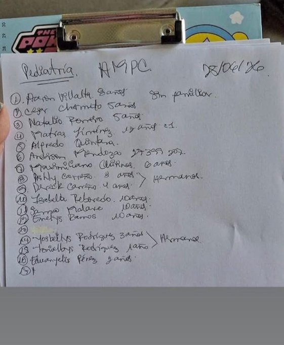

# Lista de niños en el Hospital Pérez Carreño

Link: https://x.com/AndrewsAbreu/status/2070157568241012978

Imagenes:

# Pediatría — AMPC — 25/06 del 26

> `(?)` = lectura incierta por la caligrafía. Las llaves del original agrupan a los hermanos.

| # | Nombre | Edad | Nota |
|---|--------|------|------|
| 1 | Aarón Villalta | 8 años | sin familiar |
| 2 | Cesar Charneco (?) | 5 años | |
| 3 | Natalio Ferreiro (?) | 5 años | |
| 4 | Matías Jiménez | 13 años | C.I. (?) |
| 5 | Alfredo Quintero (?) | — | |
| 6 | Anderson Mendoza | — | 27399202 (¿cédula?) |
| 7 | Maximiliano Quiñones | 6 años | |
| 8 | Ashly Carreño | 8 años | hermanos (con #9) |
| 9 | Dereck Carreño | 4 años | hermanos (con #8) |
| 10 | Isabella Reboredo | 10 años | |
| 11 | Sanna Malave (?) | 10 años | |
| 12 | Emelys Ramos | 10 años | |
| 13 | *(en blanco)* | | |
| 14 | Yosbeilys Rodríguez | 3 años | hermanos (con #15) |
| 15 | Toribelbys Rodríguez (?) | 1 año | hermanos (con #14) |
| 16 | Eduanyelis Pérez (?) | 9 años (?) | |
| 17 | *(en blanco)* | | |

