# Lista nueva de Hospital Perez Carreño

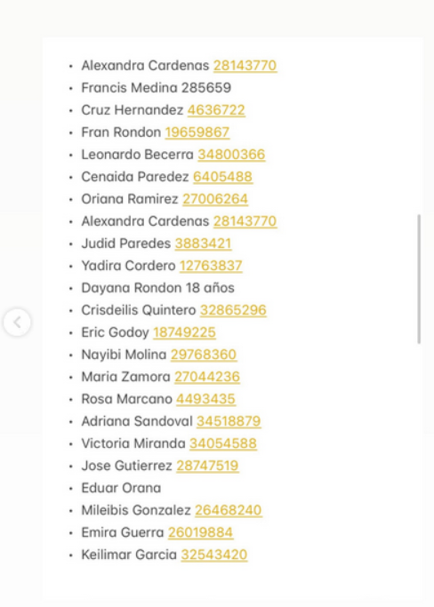
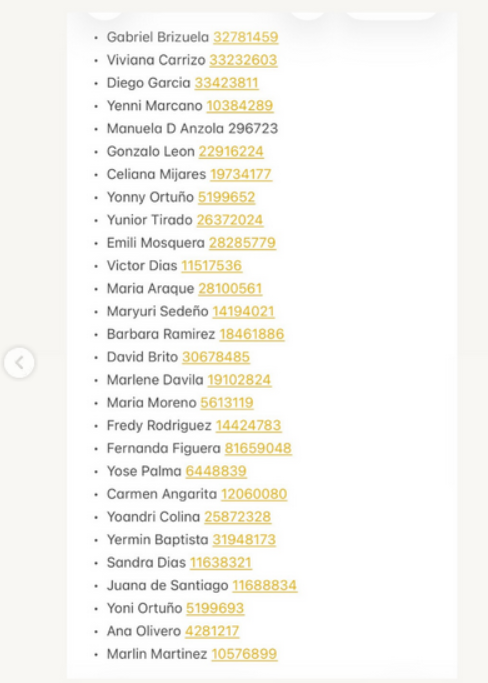
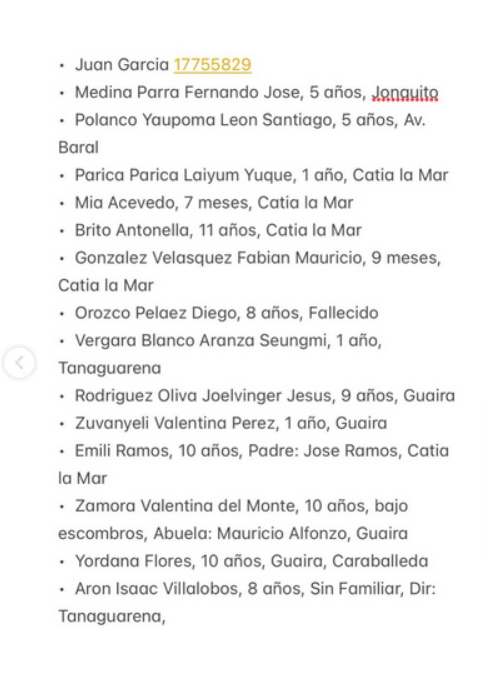
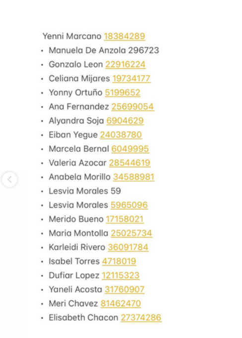
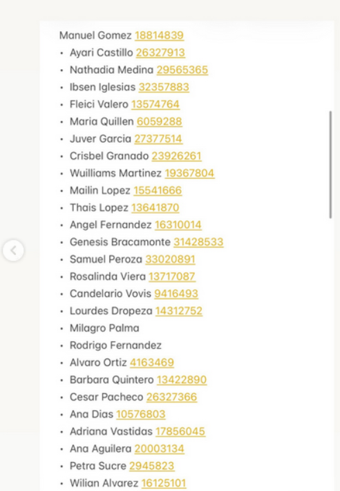
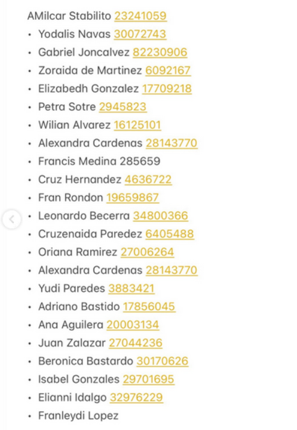
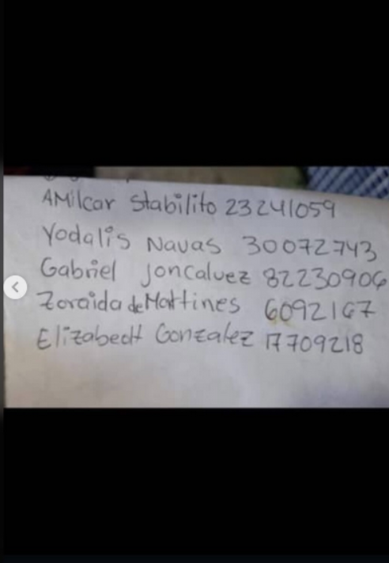
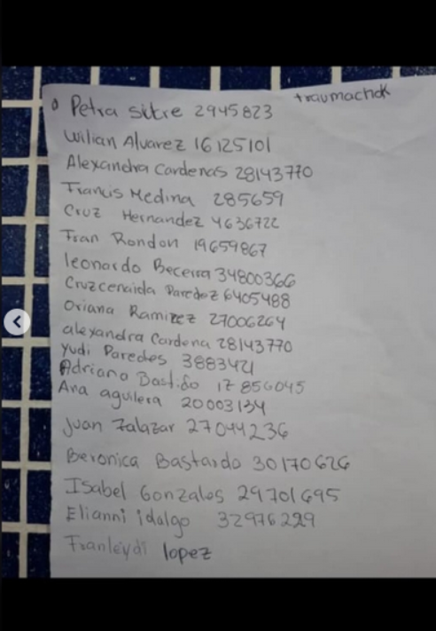
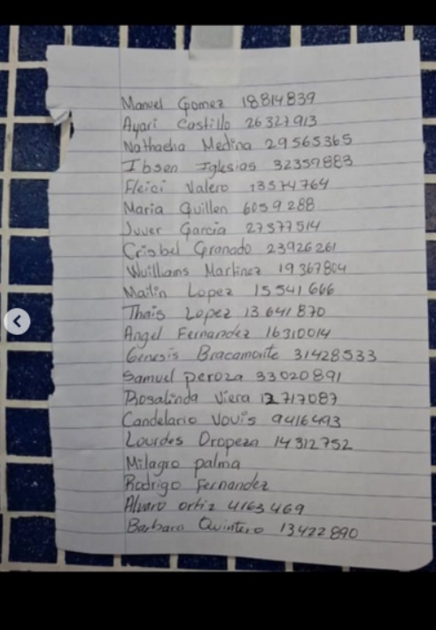
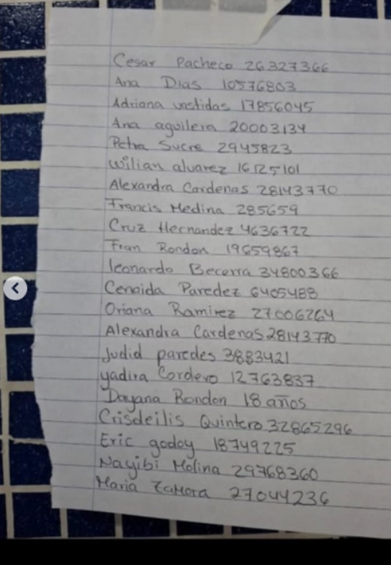
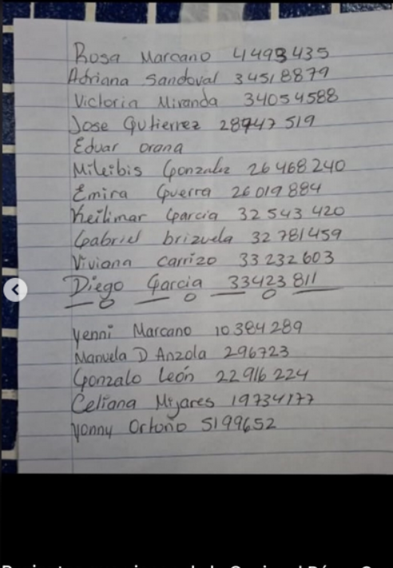
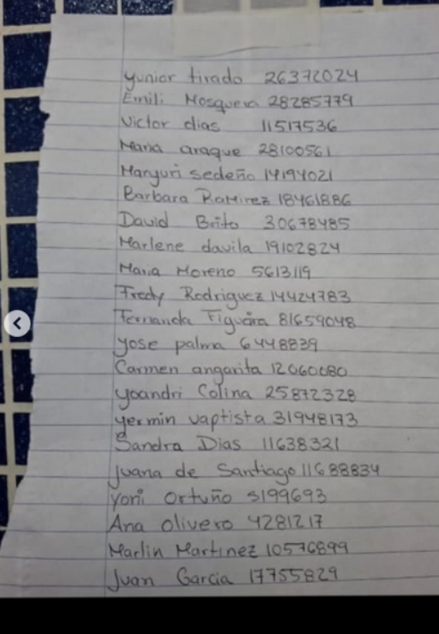
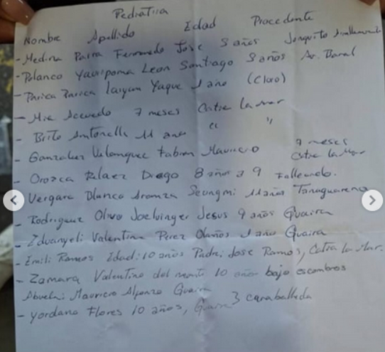
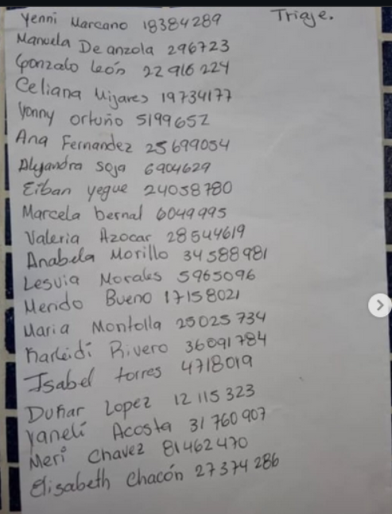

# Pediatría — Pérez Carreño (procedencia) — registros nuevos

> Lista de pacientes pediátricos con edad y lugar de procedencia (niños trasladados desde La Guaira / Catia la Mar / Tanaguarena).
> Es una lista distinta a la de "Pediatría AMPC" ya transcrita.
> `(?)` = lectura/lugar incierto.

| # | Nombre | Edad | Procedencia | Nota |
|---|--------|------|-------------|------|
| 1 | Medina Parra Fernando José | 5 años | El Junquito | |
| 2 | Polanco Yaupoma León Santiago | 5 años | Av. Baralt (?) | |
| 3 | Parica Parica Laiyum Yuque | 1 año | Catia la Mar | en el manuscrito dice "(Claro)" |
| 4 | Mía Acevedo | 7 meses | Catia la Mar | |
| 5 | Brito Antonella | 11 años | Catia la Mar | |
| 6 | González Velásquez Fabián Mauricio | 9 meses | Catia la Mar | |
| 7 | Orozco Peláez Diego | 8 años | — | **Fallecido** |
| 8 | Vergara Blanco Aranza Seungmi | 1 año | Tanaguarena | |
| 9 | Rodríguez Oliva Joelvinger Jesús | 9 años | La Guaira | |
| 10 | Zuvanyeli Valentina Pérez | 1 año | La Guaira | |
| 11 | Emili Ramos | 10 años | Catia la Mar | Padre: José Ramos · posible duplicado de "Emelys Ramos" (Pediatría AMPC) |
| 12 | Zamora Valentina del Monte | 10 años | La Guaira | rescatada bajo escombros · Abuela: Mauricio Alfonzo |
| 13 | Yordana Flores | 10 años | La Guaira (Caraballeda) | |
| 14 | Aron Isaac Villalobos | 8 años | Tanaguarena | sin familiar |
