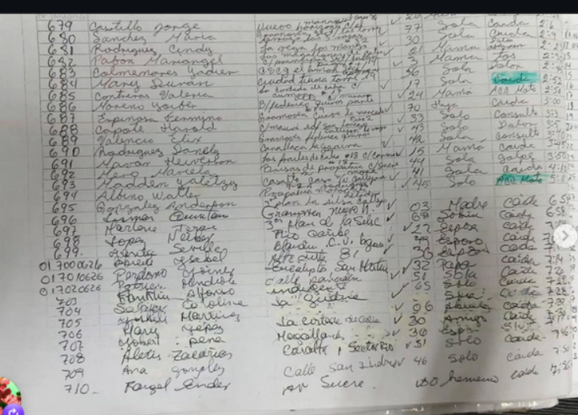
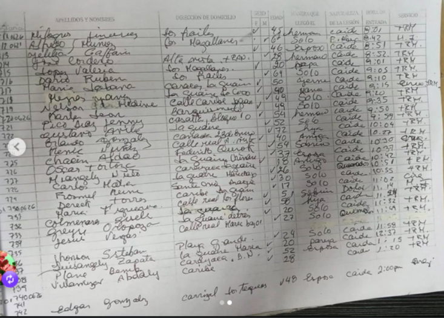

# Lista de personas heridas de la guaira llevadas al perifélrico de catia.

Link: https://www.instagram.com/p/DaAMuJHEUwJ/?img_index=2&igsh=MWFyZW9rYTlidzJqNg%3D%3D

Imagenes:

# Registro de emergencia

> Transcripción de dos páginas de un libro de registro manuscrito.
> **Importante:** la caligrafía y el desvanecimiento de la tinta hacen que muchas celdas sean de lectura incierta.
> - `(?)` = lectura probable pero no segura.
> - `—` = casilla vacía o ilegible.
>
> Conviene cotejar contra el original, especialmente la **columna de dirección** de la primera tabla y los **números de historia/cédula**, que son los datos menos legibles.

## Página 2 — Registro con columnas (más legible)

Columnas del libro: N° · Apellidos y Nombres · Dirección de domicilio · Sexo · Edad · Quién/con quién llegó · Naturaleza de la lesión · Hora de entrada · Servicio.

| N° | Apellidos y Nombres | Dirección | Sexo | Edad | Acompañante | Naturaleza lesión | Hora | Servicio |
|----|--------------------|-----------|:----:|:----:|-------------|-------------------|------|----------|
| 11426 (?) | Milagros Jiménez | Los Frailes | F | 45 | hermano | caída | 8:01 | TRM |
| 7041 (?) | Alfredo Núñez | Con Magallanes | M | 67 | solo | F. abierta (?) | 8:42 | H.I (?) |
| 13 | Ojelita Galbán (?) | — | F | 46 | esposo | caída | 8:51 | TRM |
| 14 | José Cordero | Alta Vista + RAV (?) | M | 28 | hermano | caída | 8:52 | TRM |
| 15 | López Valeria | Los Magallanes | F | 20 | papá | caída | 9:01 | TRM |
| 16 | Darío Rubén | Los Frailes | M | 64 | solo | caída | 9:05 | TRM |
| 17 | María Jabana (?) | Caracas–La Guaira | M | 50 | yerno | caída | 9:10 | enuc/TRM (?) |
| 18 | Reyes Mary | La Guaira, Lo Coco | F | 40 | yana (?) | caída | 9:20 | TRM |
| 19 | Nelson Hedaine (?) | Calle Caribe | M | 49 | solo | caída | 9:35 | TRM |
| 20 | Karle Jean | Casalta, bloque 10 | M | 54 | hermano | caída | 9:50 | TRM |
| 21 | Pico Díaz Jenny | La Guaira | F | 52 | solo | caída | 10:04 | TRM |
| 22 | Gustavo Ávila (?) | Cañada 23 de Enero | M | 72 | hija | caída | 10:27 | TRM |
| 23 | Orlando González | Calle real (?) | M | 40 | amiga | caída | 10:30 | cir (?) |
| 24 | Renic Núñez (?) | Federico Quiroz (?) | M | 54 | sobrino | caída | 10:37 | TRM |
| 25 | Chacín Aldae (?) | La Guaira, Chirau (?) | F | 37 | esposa | caída | 10:42 | TRM |
| 26 | Óscar Tortoze (?) | Caraballeda, La Guaira | M | 18 | amigo | quemado (?) | 10:51 | TRM |
| 27 | Hriangely Nieto (?) | La Quebrada, Huncho (?) | F | 26 | solo | cara (?) | 10:55 | TRM |
| 28 | Carlos Katia (?) | Santa Cruz, Aragua | M | 30 | solo | caída | 11:02 | cir (?) |
| 29 | Fromel Reine (?) | Caribe, La Guaira | M | 17 | sobrino | dolor | 11:14 | TRM |
| 30 | Dereck Torres | Calle real Los Flores | M | 5 | sobrino | caída | 11:24 | TRM |
| 731 | María Figueira (?) | La Guaira (detrás) | F | 20 | solo | quemado (?) | 11:49 | TSU |
| 732 | Colmenares Yuseli (?) | Calle real Maiquetía bajo | F | 27 | solo | caída | 11:58 | TSU |
| 733 | Greyli Oropeza (?) | — | F | 24 | solo | caída | 12:37 | TRM |
| 734 | Jesús Vegas | Playa Grande | M | 20 | pareja | caída | 1:15 | TSU |
| 735 | Jhonson Esteban | La Guaira, Maiquetía | M | 52 | esposa | caída | 1:20 | TRM |
| 736 | Luisangely Zapata | Carayaca, B.N. | F | 28 | — | — | — | — |
| 737 | Plana Bamby (?) | Caribe | — | — | — | — | — | oreja (?) |
| 738 | Villamizar Abdaly | — | — | — | — | — | — | — |
| 740066 (?) | Edgar González | Carrizal, Los Teques | M | 48 | esposa | caída | 2:00 pm | oreja (?) |

## Página 1 — Correlativos 679–710 (lectura muy incierta)

La columna de dirección de esta página es prácticamente ilegible; se deja como `—` salvo donde se intuye algo. Las horas son de la tarde.

| N° | Apellidos y Nombres | Dirección | Sexo | Edad | Acompañante | Naturaleza lesión | Hora |
|----|--------------------|-----------|:----:|:----:|-------------|-------------------|------|
| 679 | Castillo Jorge | — | M | 77 (?) | solo | caída | 2:06 |
| 680 | Sánchez María | — | F | 30 | sola | quemada (?) | 2:09 |
| 681 | Rodríguez Cindy | La Vega, Los Mangos (?) | F | 21 | mamá | dolor abdominal (?) | 2:23 |
| 682 | Pabón Mariangel | Los Magallanes (?) | F | 3 | mamá | tos | 2:30 (?) |
| 683 | Colmenares Yadier | El Limón (?) | M | 56 | solo | dolor | 2:45 |
| 684 | Mary Durán | Ciudad Tiuna, torre (?) | F | 17 | sola | caída | 2:52 |
| 685 | Contreras Valeria | — | F | 24 | mamá | acc. moto | 2:56 |
| 686 | Moreno Yorber | B/ Federico Quiroz (?) | M | 70 | hijo | caída | 3:00 |
| 687 | Espinosa Fermina | — | F | 33 | sola | consulta | 3:3x |
| 688 | Capote Harold | C/ Mauri (?) San Lorenzo | M | 43 | solo | dolor | 3:5x |
| 689 | Valencia Élix | — | — | 42 | sola | consulta | 3:40 |
| 690 | Rodríguez Sanely | Los Frailes (?) | F | 15 | mamá | golpe (?) | 3:50 |
| 691 | Nazar Heiverson (?) | Brisas de Propatria (?) | F | 44 | sola | caída | 4:1x |
| 692 | Hero Marcela (?) | — | F | 41 | sola | acc. moto | 5:08 (?) |
| 693 | Hadden Yaletzy (?) | — | M | 45 | solo | acc. moto | 5:08 (?) |
| 694 | Albino Walter | Propatria, motorizado (?) | M | — | — | — | — |
| 695 | González Anderson | 2.º plan La Silsa (?) | M | 03 | madre | caída | 6:5x |
| 696 | Lismar Quintan (?) | Gramoven, Nuevo H. (?) | M | 69 (?) | sobrino | caída | 6:58 |
| 697 | Marlene Teran (?) | 3.er plan La Silsa (?) | F | 22 | esposo | caída | 7:0x |
| 698 | López Nelber (?) | Río Caribe (?) | M | 29 (?) | esposo | caída | 7:1x |
| 699 | Yenny Sevilla (?) | Blandín, C.U. bajos (?) | M | 36 | esposa (?) | caída | 7:1x |
| 700626 (?) | Abreu Isabel | Alta vista, 81 (?) | F | — | papá | caída | 7:14 |
| 010626 (?) | Perdomo Yoiny (?) | Eucalipto, San Martín (?) | F | 32 | papá | caída | 7:2x |
| 020626 (?) | Patruc... Sondiole (?) | Calle parcelas (?) | M | 51 | sola | caída | 7:2x |
| 703 | Franklin Alfonso | Indigente (?) | M | 65 | solo | caída | 7:2x |
| 704 | Salazar Coraline (?) | La Guaira | M | 06 | abuela (?) | caída | 7:30 |
| 705 | Yulibeth Martínez (?) | La cortada de Catia (?) | F | 30 | amigo | caída | 7:3x |
| 706 | Mary Yépez | Magallanes (?) | F | 30 | esposo | salud (?) | 7:46 |
| 707 | Yohan Peña (?) | Caribe, Soternio (?) | M | 51 | solo | caída | — |
| 708 | Aletis Zacarías (?) | — | — | — | solo | caída | 7:5x |
| 709 | Ana González | Calle San Andrés (?) | — | 46 | solo | caída | 7:5x |
| 710 | Fargel Ender (?) | Av. Sucre (?) | M | uso hermano (?) | — | caída | — |