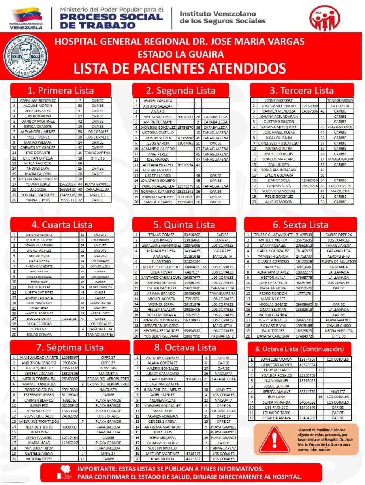

# Lista de pacientes atendidos Hospital José Maria Vargas

Link: https://x.com/AndrewsAbreu/status/2070308737328267533/photo/1
Imagen: 

# Hospital General Regional Dr. José María Vargas — Estado La Guaira

**Lista de Pacientes Atendidos** — Instituto Venezolano de los Seguros Sociales (IVSS) / Ministerio del Poder Popular para el Proceso Social de Trabajo

> Transcripción desde imagen del cartel oficial. Total: **172 pacientes** (8 listas de 20 + continuación de 12).
> Columnas vacías = dato no presente en el cartel. Algunas cédulas/nombres provienen de texto impreso y conviene verificarlos contra la fuente original si son críticos.
>
> ⚠️ *Importante (según el propio cartel): estas listas se publican con fines informativos. Para confirmar el estado de salud, dirigirse directamente al hospital.*

| Lista | Nº | Nombre | Cédula | Edad | Procedencia |
| --- | --- | --- | --- | --- | --- |
| 1ª | 1 | Abraham Gonzalez |  | 7 | Caribe |
| 1ª | 2 | Alquile Moron |  | 50 | Caribe |
| 1ª | 3 | Rosi Gonzalez |  | 41 | Caribe |
| 1ª | 4 | Luis Reboredo |  | 57 | Caribe |
| 1ª | 5 | Danisca Martinez |  | 42 | Caribe |
| 1ª | 6 | Rerica Gilmore |  | 19 | Caribe |
| 1ª | 7 | Alexander Jimenez |  | 58 | Los Corales |
| 1ª | 8 | Axel Jimenez |  | 30 | Los Corales |
| 1ª | 9 | Matias Falcon |  | 14 | Caribe |
| 1ª | 10 | Carmen Velasquez |  | 42 | Caribe |
| 1ª | 11 | Eric Dorante |  | 13 | Tanaguarena |
| 1ª | 12 | Cristian Ortega |  | 18 | Oppe 33 |
| 1ª | 13 | Mirla Pacheco |  | 69 |  |
| 1ª | 14 | Andres Laya |  | 25 | Caribe |
| 1ª | 15 | Maria Falcon |  | 18 | Caribe |
| 1ª | 16 | Alexandra Reboredo |  | 10 |  |
| 1ª | 17 | Yovani Lopez | 15625037 | 44 | Playa Grande |
| 1ª | 18 | Luis Sosa | 16888430 | 40 | Caraballeda |
| 1ª | 19 | Yosimar Marquez | 17483578 | 38 | Macuto |
| 1ª | 20 | Yanna Lemus | 7996011 | 72 | Caribe |
| 2ª | 1 | Yendel Cabarca |  |  |  |
| 2ª | 2 | Arturo Salazar |  |  |  |
| 2ª | 3 | Ana Pis |  |  |  |
| 2ª | 4 | Williana Lopez | 26648434 | 28 | Caraballeda |
| 2ª | 5 | Amira Turmani |  |  | Caraballeda |
| 2ª | 6 | Dioneisis Gonzalez | 18757095 | 36 | Caraballeda |
| 2ª | 7 | Victoria Castillo |  | 10 | Tanaguarena |
| 2ª | 8 | Jhonny Steven | 16509990 | 45 | Tanaguarena |
| 2ª | 9 | Jesus Garcia | 13044495 | 50 | Caribe |
| 2ª | 10 | Armando Caisedo |  | 67 | Tanaguarena |
| 2ª | 11 | Angi Perez |  | 45 | Tanaguarena |
| 2ª | 12 | Joel Naroza |  | 47 | Tanaguarena |
| 2ª | 13 | Adriana Bracho | 16310954 | 42 |  |
| 2ª | 14 | Adrian Tablante |  |  |  |
| 2ª | 15 | Lisbeth Jaimes |  | 48 | Caribe |
| 2ª | 16 | Jonathan Romero |  | 45 | Caribe |
| 2ª | 17 | Yarilis Calzadilla | 13373579 | 50 | Tanaguarena |
| 2ª | 18 | Roraima Carreño | 28132141 | 26 | Caribe |
| 2ª | 19 | Enrique Sanchez | 3147495 | 84 | Caribe |
| 2ª | 20 | Camila Picardo | 33218403 | 16 | Caribe |
| 3ª | 1 | Jenny Mignore |  |  | Tanaguarena |
| 3ª | 2 | Jose Daniel Rivero | 12162900 |  | La Guaira |
| 3ª | 3 | Carmen Mendoza | 14387306 | 48 | Caribe |
| 3ª | 4 | Johana Amundarain |  |  | Caribe |
| 3ª | 5 | Gustavo Rincon |  |  | Caribe |
| 3ª | 6 | Sabrina Mosqueda |  | 6 | Playa Grande |
| 3ª | 7 | Jose Angel Rosas |  | 44 | Caribe |
| 3ª | 8 | Rigal Quisaira |  | 52 | Caribe |
| 3ª | 9 | Dayelisbeth Uzcategui |  | 37 | Caribe |
| 3ª | 10 | Moreno Altra |  | 80 | Caribe |
| 3ª | 11 | Jesus Rodriguez |  | 28 | Caribe |
| 3ª | 12 | Sorielis Marcano |  | 14 | Tanaguarena |
| 3ª | 13 | Saul Rusen |  | 26 | Caribe |
| 3ª | 14 | Sonia Amundarain |  | 42 |  |
| 3ª | 15 | Evelin Guevara |  | 39 |  |
| 3ª | 16 | Danny Sosa | 11692456 | 54 | Caribe |
| 3ª | 17 | Genesis Silva | 25574216 | 30 | Los Corales |
| 3ª | 18 | Yulevis Sandoval |  | 44 | Maiquetia |
| 3ª | 19 | Rosis Gonzalez |  | 41 | Caribe |
| 3ª | 20 | Alkelis Moron |  | 50 | Caribe |
| 4ª | 1 | Antonio Herrera |  | 83 | Macuto |
| 4ª | 2 | Kembelis Ugueto |  | 38 | Los Corales |
| 4ª | 3 | Yohan Villafanda |  | 36 | Macuto |
| 4ª | 4 | Jhoalvi Rosales |  | 52 | Macuto |
| 4ª | 5 | Nestor Mora |  | 45 | Macuto |
| 4ª | 6 | Maria Viedra |  | 64 | Los Corales |
| 4ª | 7 | Antonio Venditte |  | 21 | Caraballeda |
| 4ª | 8 | Erik Salazar |  | 45 | Caribe |
| 4ª | 9 | Oscata Horrada |  | 65 | Los Corales |
| 4ª | 10 | Tibizai Diaz |  | 60 | Caribe |
| 4ª | 11 | Evelin Guerra |  | 39 | Negra Hipolita |
| 4ª | 12 | Lilibeth Gutierrez |  | 43 | Caribe |
| 4ª | 13 | Argensis Landaeta |  | 21 | Caribe |
| 4ª | 14 | Naike Zambrano |  | 41 | Tanaguarena |
| 4ª | 15 | Yonay Arias |  | 52 | Macuto |
| 4ª | 16 | Vanessa Gonzalez |  | 29 | Aeropuerto |
| 4ª | 17 | Douglas Merra | 13526796 | 47 | Caribe |
| 4ª | 18 | Rosa Escobar |  |  | Los Corales |
| 4ª | 19 | Elcio Gil |  | 4 | Caraballeda |
| 4ª | 20 | Eduar Orama |  |  | Tanaguarena |
| 5ª | 1 | Tomas Gomez | 33218202 |  | Caribe |
| 5ª | 2 | Felix Ramos | 13816060 |  | Corapal |
| 5ª | 3 | Geraldine Fernandez | 18975095 |  | Los Corales |
| 5ª | 4 | Marian Eurieta | 14314453 |  | Guanape |
| 5ª | 5 | Anais Gil | 21191038 |  | Maiquetia |
| 5ª | 6 | Elias Toro | 32304284 |  | Caribe |
| 5ª | 7 | Marielis de Salcedo | 6488422 | 65 | Los Corales |
| 5ª | 8 | Olga Tovar | 6487637 |  | Los Corales |
| 5ª | 9 | Santiago Carrasquel | 36337677 |  | Los Corales |
| 5ª | 10 | Darwin Durand | 14536129 |  | Los Corales |
| 5ª | 11 | Esther Pacheco | 23617880 |  | Caraballeda |
| 5ª | 12 | Ariana Brando | 30456508 |  | Tanaguarena |
| 5ª | 13 | Miguel Acosta | 7991965 |  | Caribe |
| 5ª | 14 | Weyner Serra | 26131879 |  | Caribe |
| 5ª | 15 | Hellen Salazar | 29815405 |  | Caribe |
| 5ª | 16 | Rosio Montana | 2007992 |  | Caribe |
| 5ª | 17 | Anzalys Dominguez | 16310977 |  | Caribe |
| 5ª | 18 | Sebastian Salcedo |  |  | Maiquetia |
| 5ª | 19 | Heydera Fernandez | 33594982 |  | Caribe |
| 5ª | 20 | Yosiedidy Guevara | 20007998 |  | Palmar Este |
| 6ª | 1 | Genesis Guacamonte | 31428533 |  | Caribe Oppe 26 |
| 6ª | 2 | Natielis Mujica | 25575635 |  | Los Corales |
| 6ª | 3 | Larry Rosales | 20560612 |  | Tanaguarena |
| 6ª | 4 | Carlos Gonzalez | 18140377 |  | Caraballeda |
| 6ª | 5 | Yamileth Garcia | 24713737 |  | Aeropuerto |
| 6ª | 6 | Charlis Cordero | 19122329 |  | Punta de Mulatos |
| 6ª | 7 | Nancy Gil | 6801699 |  | La Guaira |
| 6ª | 8 | Abraham Chavez | 18032277 |  | La Llanada |
| 6ª | 9 | Hector Avila | 17965775 |  | La Llanada |
| 6ª | 10 | Jose Uzcategui | 6225765 |  | Los Corales |
| 6ª | 11 | Natalia Mora | 28312526 |  | Caribe |
| 6ª | 12 | Pedro Rondon | 1777176 |  |  |
| 6ª | 13 | Marlin Lopez |  |  |  |
| 6ª | 14 | Nicolas Gomez | 29609660 | 24 | Caribe |
| 6ª | 15 | Omar Beltran | 13582518 |  | La Llanada |
| 6ª | 16 | Victor Guanipa |  |  | Caribe |
| 6ª | 17 | Kervi Gonzalez | 29665230 |  | Playa Grande |
| 6ª | 18 | Richard Rivas | 15929488 |  | Camurichico |
| 6ª | 19 | Raul Torres | 18923829 |  | Negra Hipolita |
| 6ª | 20 | Dayana Cardona | 17484972 |  | Oppe 30 |
| 7ª | 1 | Maigualidad Iriarte | 11058667 |  | Oppe 27 |
| 7ª | 2 | Anderson Rengifo | 7995694 |  | Oppe 27 |
| 7ª | 3 | Belen Quintero | 20560037 |  | Bowling |
| 7ª | 4 | Jenifer Lizcano | 13827306 |  | Maiquetia |
| 7ª | 5 | Merlin Torrealba | 26363002 |  | Brisas del Aeropuerto |
| 7ª | 6 | Maikal Torrealba |  |  | Brisas del Aeropuerto |
| 7ª | 7 | Rodrigo Colon | 29910634 |  | Naiguata |
| 7ª | 8 | Esteffany Jessen | 31106940 |  | Caribe |
| 7ª | 9 | Carmen Blanco | 6331767 |  | Playa Grande |
| 7ª | 10 | Iliana Pez | 32106940 |  | Playa Grande |
| 7ª | 11 | Johana Lopez | 15839387 |  | Playa Grande |
| 7ª | 12 | Yesive Querales | 24182992 |  | Los Corales |
| 7ª | 13 | Mielraine Frontados |  | 7 | Playa Grande |
| 7ª | 14 | Nely de Freites | 6800389 |  | Caraballeda |
| 7ª | 15 | Diego Diaz |  |  | Caraballeda |
| 7ª | 16 | Jenny Ramirez | 12717464 |  | Caribe |
| 7ª | 17 | Maria Ugas | 11966827 |  | Playa Grande |
| 7ª | 18 | Ana Lucia Hilda |  | 4 | Caraballeda |
| 7ª | 19 | Genyelis Arena |  | 7 | Oppe 27 |
| 7ª | 20 | Victoria Perez |  |  | Caribe |
| 8ª | 1 | Victoria Gonzalez |  | 3 | Caribe |
| 8ª | 2 | Alana Gonzalez |  | 6 | Caribe |
| 8ª | 3 | Valeris Gonzalez |  | 10 | Caribe |
| 8ª | 4 | Junior Camacaro |  | 26 | Naiguata |
| 8ª | 5 | Dario Ramirez | 30824977 | 21 | Caraballeda |
| 8ª | 6 | Sebastian Blandin |  | 7 |  |
| 8ª | 7 | Juan Carlos Jimenez |  | 10 | Macuto |
| 8ª | 8 | Axeil Jimenez |  | 4 | Los Corales |
| 8ª | 9 | Andrew Rojas |  | 6 | Naiguata |
| 8ª | 10 | Yoeviyer Rodriguez |  | 9 | Oppe 26 |
| 8ª | 11 | Maya Leon |  | 4 | Caraballeda |
| 8ª | 12 | Aranza Vergara |  | 9 | Oppe 27 |
| 8ª | 13 | Gendelis Arena |  | 15 | Oppe 27 |
| 8ª | 14 | Anarema Machado |  | 9 | Playa Grande |
| 8ª | 15 | Deira Leon |  | 7 | Playa Grande |
| 8ª | 16 | Sofia Sequera |  | 5 | Playa Grande |
| 8ª | 17 | Eduaryelis Perez |  | 2 | Caribe |
| 8ª | 18 | Yoselin Badillo |  | 7 | Tanaguarena |
| 8ª | 19 | Matilde Martinez | 4348517 |  | Los Corales |
| 8ª | 20 | Juan Moron | 4121307 |  | Caribe |
| 8ª (cont.) | 1 | Juan Luis Moron | 13374907 |  | Los Corales |
| 8ª (cont.) | 2 | Hernesto Moyer | 13223654 |  |  |
| 8ª (cont.) | 3 | Endy Millano |  | 11 |  |
| 8ª (cont.) | 4 | Yoalber Rosales | 22250708 |  | Caribe |
| 8ª (cont.) | 5 | Juan Manuel | 13515025 |  | Caribe |
| 8ª (cont.) | 6 | Josue Guerra |  |  |  |
| 8ª (cont.) | 7 | Rebeca Malave | 33344762 |  | Macuto |
| 8ª (cont.) | 8 | Elia Luna |  | 16 | Los Corales |
| 8ª (cont.) | 9 | Sonia Miranda | 34054588 |  | Los Corales |
| 8ª (cont.) | 10 | Liss Pacheco | 11406862 |  | Caribe |
| 8ª (cont.) | 11 | Eduardo Tabio |  |  | Caribe |
| 8ª (cont.) | 12 | Rosalba Amaya | 25464509 |  | Caribe |